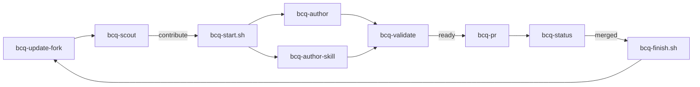

# BCQuality contributor toolkit

Claude Code skills, scripts, and templates that turn "I should contribute to
[microsoft/BCQuality](https://github.com/microsoft/BCQuality)" into a repeatable loop, living on
the `main` branch of this fork. Read [`CLAUDE.md`](../CLAUDE.md) for the rules; this file explains
the design and the process.

## Why a toolkit

BCQuality is a remedial knowledge base with a locked schema and a hard admission test:
a file exists only if a capable LLM would get something wrong without it. Upstream CI
validates frontmatter, sections, size, and samples; two bots auto-close `custom/` PRs and
flag stray top-level folders; a maintainer asks "would the model really miss this?" on every
file. The toolkit front-loads all of that so a PR arrives already answering the questions.

## The repository model

```
main                       = upstream/main + toolkit commit(s)   ← you sit here, skills loaded, never PR'd
.claude/worktrees/<slug>   = community/<domain>/<slug> branch    ← cut from upstream/main, one per contribution
```

A contribution is a git worktree, so its diff against `upstream/main` can only contain the
article. The toolkit cannot leak into a PR by construction, and you never switch branches in the
checkout that holds the skills. Updating the fork is a merge of `upstream/main` into `main`
(the toolkit commit stays on top) plus a rebase of the open worktrees.

## The loop



`/bcq-contribute` runs the whole loop and stops twice: to pick a candidate, and to confirm the push and PR. `/bcq-from-guidelines` is the interactive front door: it lists what the company layer could contribute, checks each against upstream (reusing the scout backlog while `bcq-backlog-status.sh` says it is fresh), asks you to pick, and then runs the rest.

## Design choices worth stealing

- **Contracts are read live, never copied.** `skills/read.md`, `write.md`, `do.md`, `entry.md` are the truth; the skills point at them and add only conventions the contracts leave implicit (the community tagline, `Good`/`Bad` object names, commit subjects, branch names).
- **Scripts do the deterministic work, the model does the judgment.** `bcq-validate.sh` runs the same three checks upstream CI runs, plus the bot guards, plus contributor lint. The skill layers the cold/warm review proof on top.
- **Three gates before authoring.** Admission (is it remedial?), overlap (does it exist?), portability (does the fact survive without the company policy?). Most candidates die here, cheaply: of 20 iFacto articles, 5 survived.
- **Neutralise before the cold review.** The first cold run answered "the core defect the sample is about": the file name, the `Good`/`Bad` object names, and the comments had leaked the verdict. `bcq-neutralize.sh` copies the sample under a hashed name with comments stripped and the tokens removed, the same trick the upstream evaluation harness uses.
- **The cold/warm review proof.** A fresh subagent reviews the neutralised bad sample without the article (cold). If it already finds the defect, the file fails the admission test. Then it reviews with the article as its only rule (warm): bad must be flagged citing the path, good must stay clean. The transcript goes in the PR body as evidence.
- **Pick a domain with a review leaf.** `al-code-review` sources articles by domain; a community domain without `microsoft/skills/review/al-<domain>-review.md` is never read by the reviewer.
- **Six frontmatter keys, exactly.** Attribution is the git author. An `author:` key fails CI.
- **Process artefacts are committed.** Scout backlogs, validation evidence, and the PR ledger live in `.claude/` on `main`, so the fork itself documents how each contribution was made.

## Alternatives considered

| Approach | Why not (or when yes) |
|---|---|
| Toolkit git-excluded via `.git/info/exclude` | First version. Invisible, unshareable, and the process could not be reproduced from the repo. |
| Skills in `~/.claude/skills` (user-level) | Always loaded, but not part of the repository and not tied to the fork. |
| Pristine fork plus a separate toolkit repo, fork as an additional working directory | Fully valid. Fork `main` stays identical to upstream and GitHub's "Sync fork" button works. Costs two repos to keep in sync, cross-directory permission prompts, and a two-place story. Switch to it if the toolkit should become an installable plugin for other contributors. |
| PR branches cut from the fork's `main` | The toolkit rides into the PR and the top-level bot flags `.claude/`. |
| Toolkit in `custom/` | `custom/` is for BCQuality-format knowledge and action skills consumed by agents, not Claude Code skills; mixing the two confuses both readers. |
| Rebase instead of merge for updating the fork | Cleaner history (`upstream + 1`), but needs `--force-with-lease` on `main` every time. Merge keeps `main` push-safe. |

## Layout

```
CLAUDE.md                      workspace rules, loaded every session
.claude/
├── README.md                  this file
├── .gitignore                 ignores worktrees/
├── skills/bcq-*/SKILL.md      the nine skills
├── scripts/                   _lib.sh · bcq-update-fork.sh · bcq-start.sh · bcq-finish.sh · bcq-new-article.sh
│                              bcq-validate.sh · bcq-neutralize.sh · bcq-coverage.sh · bcq-backlog-status.sh
├── templates/                 knowledge-article.md · sample.good.al · sample.bad.al · action-skill.md · pr-body.md
├── scout/                     triage backlogs, one per source
├── validation/                review-proof evidence and PR bodies, one per slug
├── contributions.md           ledger of PRs
└── worktrees/<slug>/          contribution checkouts (ignored)
```
