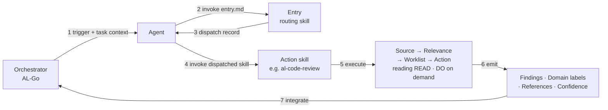

# How agents consume BCQuality

BCQuality is content — knowledge files and skills. It is consumed by agents that live elsewhere (AL-Go, a VS Code extension, a GitHub Agent invocation, etc.). This document explains the end-to-end flow, so that skill authors, orchestrator maintainers, and contributors share one mental model.

For the high-level framing and repo structure, start with the [README](README.md). This document is the operational view.

## The actors

- **Orchestrator** — the tool that triggers work (e.g. AL-Go on a pull request, or a VS Code extension on save). Lives *outside* BCQuality. Knows *when* to run something, not *what* to run.
- **Agent** — an LLM-driven process spawned by the orchestrator. The agent has no built-in knowledge of BC or of BCQuality's conventions. It knows how to read instructions and call tools.
- **BCQuality repo** — two kinds of content:
  - **Global skills** in `/skills/` — the `entry.md` entry-point skill plus the READ · DO · WRITE contracts that govern the rest of the repo.
  - **Layer content** in `/microsoft/`, `/community/`, and `/custom/` — knowledge files and action skills grouped by authority.

When BCQuality is installed as a standalone plugin, it additionally exposes
`skills/al-code-review/SKILL.md`. This is a host-format adapter, not another
action skill: it creates the task context and enters the same flow at Entry.

## The flow

### 1. Orchestrator triggers
The orchestrator has a URL setting that points at BCQuality (default: `github.com/microsoft/BCQuality`) and a task to perform. It hands the agent a **task context** — goal, inputs available (`pr-diff`, `file-path`, …), technologies, BC version, enabled layers — and says: *your source of truth lives at that URL; start by invoking `/skills/entry.md`*.

### 2. Agent invokes Entry
The agent reads `/skills/entry.md` and runs it against the task context. Entry applies its Source → Relevance → Worklist → Action steps over the action skills under `*/skills/**/*.md` and returns a **dispatch record**: the set of action skills to invoke, plus a list of candidates it skipped (with reasons). Routing is a skill, not orchestrator logic.

For a standalone plugin installation, the host activates the
`skills/al-code-review/SKILL.md` adapter first. That adapter preserves the
caller's actual goal, constructs the task context, and invokes Entry. It does
not select the internal `microsoft/skills/review/al-code-review.md` action skill
itself or duplicate Entry's preparation, routing, and failure semantics.

### 3. Agent consumes the dispatch record
The dispatch record names one or more action skills and the subset of inputs each should receive. If the outcome is `no-match` or `failed`, the agent returns the record to the orchestrator unchanged.

### 4. Agent invokes each dispatched action skill
Action skills live inside the layers — `/microsoft/skills/`, `/community/skills/`, `/custom/skills/` — so their authority is carried by their location. For a PR review, Entry typically dispatches `microsoft/skills/review/al-code-review.md`. The agent reads the file and executes it.

### 5. Action skill executes the four-step pattern

Each action skill is a markdown file that specifies what to do at each step. The template is always the same:

| Step | What happens |
| --- | --- |
| **Source** | Declare which knowledge folders and tags to search. |
| **Relevance** | Filter by frontmatter — `bc-version`, `technologies`, `countries`, `application-area`. |
| **Worklist** | Narrow from N candidates to the M that apply to this specific task. |
| **Action** | Apply the relevant knowledge and produce structured output. |

Example: a performance review skill sources from `/microsoft/knowledge/performance/` and `/community/knowledge/performance/`, filters to `bc-version: 26` and `technologies: [al]`, narrows the 25 candidate files to the 8 that apply to the 15 objects changed in the PR, and then evaluates each file against the diff.

At this point the agent reads READ and DO on demand — it needs READ to interpret each knowledge file's frontmatter and sections, and DO to shape its output. Those contracts are fetched when first needed, not as part of bootstrap.

### 5a. The knowledge index (Source acceleration)

Discovering candidates at the Source step naively means opening every file under a domain folder just to read its frontmatter `keywords` — on a large corpus that is hundreds of file reads per review. To avoid this, BCQuality maintains a **knowledge index**: a single artifact (`knowledge-index.json`) that lists every article surviving the consumer's layer/allow-deny filtering and carries, per article, the exact inputs the Source/Worklist steps consume — `path`, `layer`, `domain`, frontmatter dimensions, `keywords`, `title`, and a one-line `description` hint.

The index is **owned and produced by BCQuality**, not by each consumer: its generator (`tools/Build-KnowledgeIndex.ps1`) ships here, next to the skills and knowledge it derives from, so the index schema stays in lockstep with the Source contract and every consumer gets the same faithful index for free instead of re-implementing the parser. The consuming orchestrator does **not** build or invoke the index — it only prunes its clone to policy as it already does. The index is then (re)generated by BCQuality itself: **Entry's preparation step runs `Build-KnowledgeIndex.ps1` over the live, already-pruned clone** at the start of every run (see `skills/entry.md`), and BCQuality CI (`.github/workflows/knowledge-index.yml`) validates that the generator is healthy and deterministic. Building over the *pruned* clone — rather than shipping a committed full-corpus index that consumers trust — keeps the index exact for any consumer policy: it can never list an article the consumer denied, so policy-excluded rules cannot leak into discovery.

The index changes only *how candidates are discovered*, never *which are selected*. The Worklist predicate is unchanged — `keywords` still drive selection — and the agent still opens each worklisted article **in full** to read its `## Best Practice` / `## Anti Pattern` rule bodies; the index is discovery metadata only and never substitutes for the article body. When no index is present, skills fall back to path-based discovery (collect by domain folder), so review still works.

### 6. Agent emits structured output
The output contract is defined in the DO meta-skill so that every action skill — today's and next year's — produces the same shape:

- **Outcome** — `completed`, `not-applicable`, `no-knowledge`, `partial`, or `failed`. An orchestrator can distinguish a clean run from a no-op from a failure without guessing.
- **Findings** — what the skill observed (severity, message, optional location).
- **Domain** — the producer-owned, human-readable display label on each review finding.
- **References** — structured objects (`path` plus optional commit `sha`) pointing to the knowledge files that informed each finding.
- **Confidence** — per-finding evidence strength.
- **Suppressed** — knowledge files that were discarded by layer precedence or configuration, so reviewers can see what was overridden.

The orchestrator parses this **without skill-specific logic**. This is the point of the contract: orchestrators and action skills evolve independently.

### 7. Orchestrator integrates
The orchestrator turns findings into PR comments, build gates, or IDE diagnostics, and links the references back to the knowledge files so the PR author — human or agent — can read the guidance.

## Knowledge-backed and agent findings

BCQuality is an **additive** knowledge layer. The agent surfaces two kinds of findings, both shaped to the same DO output contract:

- **Knowledge-backed findings** carry one or more entries in `references[]` pointing at BCQuality knowledge files. Their `id` is the primary file's repo-relative path. Leaf sub-skills set `domain` to their human-readable display label, and super-skills preserve it verbatim during rollup.
- **Agent findings** carry an empty `references: []`, use a slug `id` prefixed `agent:`, and have `confidence` capped at `medium`. A leaf can emit one strictly within its own domain and uses that leaf's display label. A super-skill can emit a cross-cutting agent finding with `from-sub-skill: "agent"` and `domain: "Agent"`. Their `message` is self-contained because there is no knowledge-file footer to fall back on.

Before a skill emits an agent finding, it validates the candidate against the BCQuality knowledge already loaded for the task: a matching file upgrades the candidate to a knowledge-backed finding (and merges or deduplicates against relevant existing output); a contradicting file suppresses the candidate. Only candidates with no BCQuality coverage become agent findings.

Orchestrators MUST tolerate an absent `domain` in reports from older producers. When it is present, treat it as display text rather than an identifier: preserve the full string and its case, whitespace, punctuation, and non-ASCII characters, escaping only for the target rendering format. Do not tokenize it on spaces or use a lowercased or slugified form as the sole metadata or deduplication key, because distinct labels can collapse to the same slug. Retain the exact string, use a lossless encoding, or use a collision-resistant digest instead. Orchestrators MAY render knowledge-backed and agent findings differently and MAY apply independent severity floors; `references: []` and the `agent:` id prefix distinguish agent findings, while `from-sub-skill: "agent"` identifies those emitted by the super-skill itself.

## Why this architecture

- **Entry is the only hardcoded thing.** Orchestrators ship with one convention — *"invoke `/skills/entry.md` first"* — and nothing else. New action skills and new knowledge files are picked up automatically because Entry discovers them at dispatch time.
- **Standalone installation adds an adapter, not another policy layer.** The
  plugin's host-format `al-code-review` skill only translates the invocation
  into Entry's task context. Entry and the dispatched action skills remain
  authoritative.
- **Layers decide authority, not code.** The agent sees `/microsoft/` and `/community/` together; if two files conflict, the precedence rule defined in READ resolves it. A partner fork can disable `/community/` — that's a config choice, not a code change.
- **Knowledge and skills evolve independently.** A new knowledge file requires no skill changes — existing skills pick it up via frontmatter filters. A new skill requires no knowledge changes — it sources from what's already there.

## The mental model, in one sentence

The orchestrator knows **when** to run; Entry decides **which skill** to run; the action skills define **what** to do; the meta-skills teach the agent **how** to behave; the knowledge files are **what** the agent knows.
