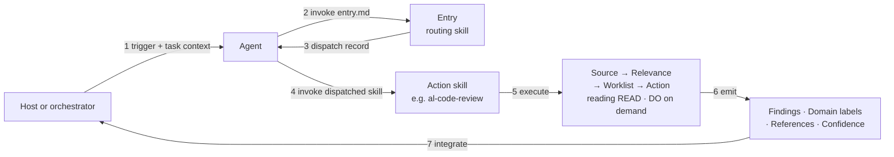

# How agents consume BCQuality

BCQuality is content — knowledge files and skills. It is consumed by agents
supplied by a host or orchestrator. This document explains the end-to-end flow
so that skill authors, orchestrator maintainers, and contributors share one
mental model.

[Documentation](README.md) | [Partner quick start](../README.md#quick-start) | [Runner contract](standalone-runner.md)

This is the operational reference for integration authors. Partners using
the installed plugin do not need to implement this flow themselves.

## Try a minimal integration

**"Invoke `skills/entry.md`" means ask your agent to read and follow that
instruction document.** It is not a shell command, HTTP endpoint, or executable
library. Your host must be able to read files, enumerate directories, and
execute the selected skills as instructed. Merely mentioning BCQuality does
not make its content available to the model.

For a first integration, create or reuse a dedicated BCQuality checkout.
For example, in PowerShell:

```powershell
git clone https://github.com/microsoft/BCQuality.git "C:\Knowledge\BCQuality"
```

Give the host access to **both** that content directory and your own app
directory. The plugin is not required for this route. Replace the paths and
BC version below with your actual values, then send this prompt to the agent:

```text
BCQuality root: C:\Knowledge\BCQuality
Review input: folder-path = C:\Repos\MyBusinessCentralApp

Read BCQuality's skills\entry.md and follow it with this task context:
task-context:
  goal: Review the complete AL app without changing its source files.
  inputs-available: [folder-path]
  technologies: [al]
  bc-version: 28
  enabled-layers: [microsoft, community, custom]
  disabled-skills: []

Resolve BCQuality instructions, knowledge, and index preparation against the
BCQuality root, not the app directory. Pass the actual review-input path above
when a dispatched skill accepts folder-path.
Follow Entry's preparation and dispatch instructions. Execute every dispatched
action skill with its exact input subset, reading READ and DO on demand.
Return each complete findings report unchanged. If Entry returns no-match or
failed, return that dispatch record unchanged instead of inventing a review.
```

`inputs-available` lists input **types**; the `Review input` line binds the type
to the actual app directory. It is not an extra Entry schema field. Omit
`bc-version` when unknown rather than guessing it; add localization or
application-area context only when known. Keep the two roots distinct so index
preparation operates on BCQuality, not your app.

Expect Entry to select the action skills and the agent to execute them.
A broad review normally returns the Microsoft coordinator's report with
domain `sub-results`, plus any separately dispatched reports. Each report
must retain its outcome, including incomplete or failed work; see
[reading results](using-bcquality.md#reading-your-results). A dispatch record
alone is not a completed review.

This prompt delegates the existing protocol rather than implementing new
routing logic. For repeatable runs, [pin the checkout](customizing-bcquality.md#updates-and-versions).
Add scheduling, retries, and rendering only when needed, using the
[runner contract](standalone-runner.md).

## The actors

- **Orchestrator** — the tool that triggers work. Lives *outside* BCQuality. Knows *when* to run something, not *what* to run.
- **Agent** — an LLM-driven process supplied by the host. It brings its own coding knowledge and tools; BCQuality adds curated guidance and execution contracts.
- **BCQuality repo** — two kinds of content:
  - **Global skills** in `/skills/` — the `entry.md` entry-point skill plus the READ · DO · WRITE contracts that govern the rest of the repo.
  - **Layer content** in `/microsoft/`, `/community/`, and `/custom/` — knowledge files and action skills grouped by authority.

When BCQuality is installed as a standalone plugin, it additionally exposes
`skills/al-code-review/SKILL.md`. This is a host-format adapter, not another
action skill: it creates the task context and enters the same flow at Entry.

## Repository structure

| Path | Purpose |
| --- | --- |
| `skills/entry.md` | Routes a task to action skills. |
| `skills/read.md`, `skills/do.md`, `skills/write.md` | Stable knowledge, action-skill, and authoring contracts. |
| `skills/al-code-review/SKILL.md` | Host-format plugin adapter. |
| `<layer>/knowledge/<domain>/` | Atomic articles and optional sibling samples. |
| `<layer>/skills/` | Layer-owned action skills. |
| `docs/` | Partner guides and integration references. |
| `evaluation/` | Neutral review fixtures and scoring contract. |
| `tools/` | Knowledge-index and evaluation tooling. |
| `.github/` | Validation and repository workflows. |

Layers are `microsoft`, `community`, and `custom`; Custom is a template for
consumer forks. An action skill either evaluates knowledge directly (a leaf)
or composes declared leaves (a super-skill). See [global skills](../skills/README.md)
for the distinction between host-native packaging and these internal formats.

## The flow



### 1. Orchestrator triggers
The orchestrator has a URL setting that points at BCQuality (default: `github.com/microsoft/BCQuality`) and a task to perform. It hands the agent a **task context** — goal, inputs available (`pr-diff`, `file-path`, …), technologies, BC version, enabled layers — and says: *your source of truth lives at that URL; start by invoking `/skills/entry.md`*.

### 2. Agent invokes Entry
The agent reads `/skills/entry.md` and runs it against the task context. Entry applies its Source → Relevance → Worklist → Action steps over the action skills under `*/skills/**/*.md` and returns a **dispatch record**: the set of action skills to invoke, plus a list of candidates it skipped (with reasons). Routing is a skill, not orchestrator logic.

For a standalone plugin installation, the host activates the
`skills/al-code-review/SKILL.md` adapter first. That adapter preserves the
caller's actual goal, constructs the task context, and invokes Entry. It does
not select the internal `microsoft/skills/review/al-code-review.md` action skill
itself or duplicate Entry's preparation, routing, and failure semantics.

### 3. Agent consumes the dispatch record
The dispatch record names one or more action skills and the subset of inputs each should receive. If the outcome is `no-match` or `failed`, the agent returns the record to the orchestrator unchanged.

### 4. Agent invokes each dispatched action skill
Action skills live inside the layers — `/microsoft/skills/`, `/community/skills/`, `/custom/skills/` — so their authority is carried by their location. For a PR review, Entry typically dispatches `microsoft/skills/review/al-code-review.md`. The agent reads the file and executes it.

### 5. Action skill executes the four-step pattern

Each action skill is a markdown file that specifies what to do at each step. The template is always the same:

| Step | What happens |
| --- | --- |
| **Source** | Declare which knowledge folders and tags to search. |
| **Relevance** | Filter by frontmatter — `bc-version`, `technologies`, `countries`, `application-area`. |
| **Worklist** | Narrow from N candidates to the M that apply to this specific task. |
| **Action** | Apply the relevant knowledge and produce structured output. |

Example: the Microsoft-owned performance review skill selects `performance` entries across every enabled layer, filters to `bc-version: 26` and `technologies: [al]`, narrows the candidate files to those that apply to the changed objects, and then evaluates each file against the diff. Its canonical corpus lives beside it under `/microsoft/knowledge/performance/`; cross-layer entries are limited to custom overrides or short-lived promotion work.

At this point the agent reads READ and DO on demand — it needs READ to interpret each knowledge file's frontmatter and sections, and DO to shape its output. Those contracts are fetched when first needed, not as part of bootstrap.

### 5a. The knowledge index (Source acceleration)

Discovering candidates at the Source step naively means opening every file under a domain folder just to read its frontmatter `keywords` — on a large corpus that is hundreds of file reads per review. To avoid this, BCQuality maintains a **knowledge index**: a single artifact (`knowledge-index.json`) that lists every article surviving the consumer's layer/allow-deny filtering and carries, per article, the exact inputs the Source/Worklist steps consume — `path`, `layer`, `domain`, frontmatter dimensions, `keywords`, `title`, and a one-line `description` hint.

The index is **owned and produced by BCQuality**, not reimplemented by each
consumer. Its generator, `tools/Build-KnowledgeIndex.ps1`, ships here alongside
the content. Entry ensures the index reflects the live tree before routing
and regenerates it when absent or not known to be current. BCQuality CI
validates that the generator is healthy and deterministic.

Consumers with allow/deny policy must prune their content copy **before**
Entry runs. Building over that pruned tree prevents removed articles from
entering discovery. A standalone plugin normally ships the whole tree:
`enabled-layers` filters discovery but does not remove files or enforce a
security boundary. See [layer selection](customizing-bcquality.md#select-layers-or-disable-a-review).

The index changes only *how candidates are discovered*, never *which are selected*. The Worklist predicate is unchanged — `keywords` still drive selection — and the agent still opens each worklisted article **in full** to read its `## Best Practice` / `## Anti Pattern` rule bodies; the index is discovery metadata only and never substitutes for the article body. When no index is present, skills fall back to path-based discovery (collect by domain folder), so review still works.

### 6. Agent emits structured output
The output contract is defined in the DO meta-skill so that every action skill — today's and next year's — produces the same shape:

- **Outcome** — `completed`, `not-applicable`, `no-knowledge`, `partial`, or `failed`. An orchestrator can distinguish a clean run from a no-op from a failure without guessing.
- **Findings** — what the skill observed (severity, message, optional location).
- **Domain** — the producer-owned, human-readable display label on each review finding.
- **References** — structured objects (`path` plus optional commit `sha`) pointing to the knowledge files that informed each finding.
- **Confidence** — per-finding evidence strength.
- **Suppressed** — knowledge files that were discarded by layer precedence or configuration, so reviewers can see what was overridden.

The orchestrator parses this **without skill-specific logic**. This is the point of the contract: orchestrators and action skills evolve independently.

### 7. Orchestrator integrates
The orchestrator turns findings into PR comments, build gates, or IDE diagnostics, and links the references back to the knowledge files so the PR author — human or agent — can read the guidance.

## Knowledge-backed and agent findings

BCQuality is an **additive** knowledge layer. The agent surfaces two kinds of findings, both shaped to the same DO output contract:

- **Knowledge-backed findings** carry one or more entries in `references[]` pointing at BCQuality knowledge files. Their `id` is the primary file's repo-relative path. Leaf sub-skills set `domain` to their human-readable display label, and super-skills preserve it verbatim during rollup.
- **Agent findings** carry an empty `references: []`, use a slug `id` prefixed `agent:`, and have `confidence` capped at `medium`. A leaf can emit one strictly within its own domain and uses that leaf's display label. A super-skill can emit a cross-cutting agent finding with `from-sub-skill: "agent"` and `domain: "Agent"`. Their `message` is self-contained because there is no knowledge-file footer to fall back on.

Before a skill emits an agent finding, it validates the candidate against the BCQuality knowledge already loaded for the task: a matching file upgrades the candidate to a knowledge-backed finding (and merges or deduplicates against relevant existing output); a contradicting file suppresses the candidate. Only candidates with no BCQuality coverage become agent findings.

Orchestrators MUST tolerate an absent `domain` in reports from older producers. When it is present, treat it as display text rather than an identifier: preserve the full string and its case, whitespace, punctuation, and non-ASCII characters, escaping only for the target rendering format. Do not tokenize it on spaces or use a lowercased or slugified form as the sole metadata or deduplication key, because distinct labels can collapse to the same slug. Retain the exact string, use a lossless encoding, or use a collision-resistant digest instead. Orchestrators MAY render knowledge-backed and agent findings differently and MAY apply independent severity floors; `references: []` and the `agent:` id prefix distinguish agent findings, while `from-sub-skill: "agent"` identifies those emitted by the super-skill itself.

## Why this architecture

- **Entry is the only hardcoded thing.** Orchestrators ship with one convention — *"invoke `/skills/entry.md` first"* — and nothing else. New action skills and new knowledge files are picked up automatically because Entry discovers them at dispatch time.
- **Standalone installation adds an adapter, not another policy layer.** The
  plugin's host-format `al-code-review` skill only translates the invocation
  into Entry's task context. Entry and the dispatched action skills remain
  authoritative.
- **Layers decide authority, not code.** The agent sees `/microsoft/` and `/community/` together; if two files conflict, the precedence rule defined in READ resolves it. A partner fork can disable `/community/` — that's a config choice, not a code change.
- **Knowledge and skills evolve independently within their owning layer.** A new knowledge file requires no skill changes because existing skills pick it up via frontmatter filters. Layer placement still follows skill ownership, so promoting a skill also promotes its canonical corpus.

## The mental model, in one sentence

The orchestrator knows **when** to run; Entry decides **which skill** to run; the action skills define **what** to do; the meta-skills teach the agent **how** to behave; the knowledge files are **what** the agent knows.
